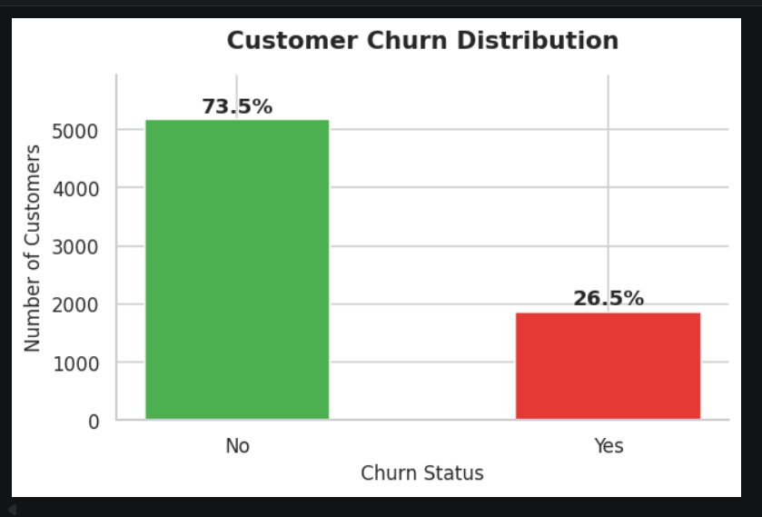
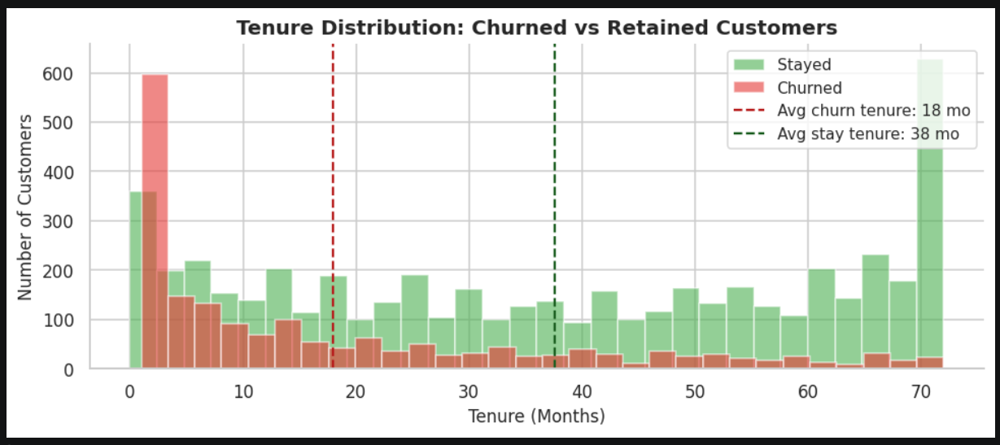
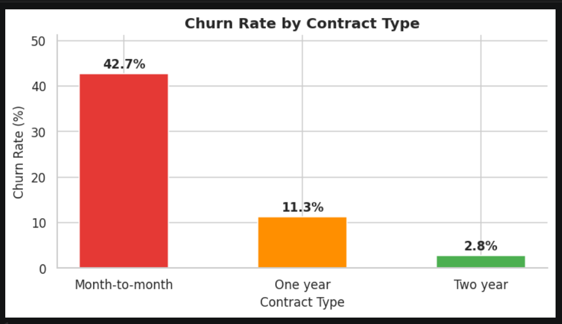
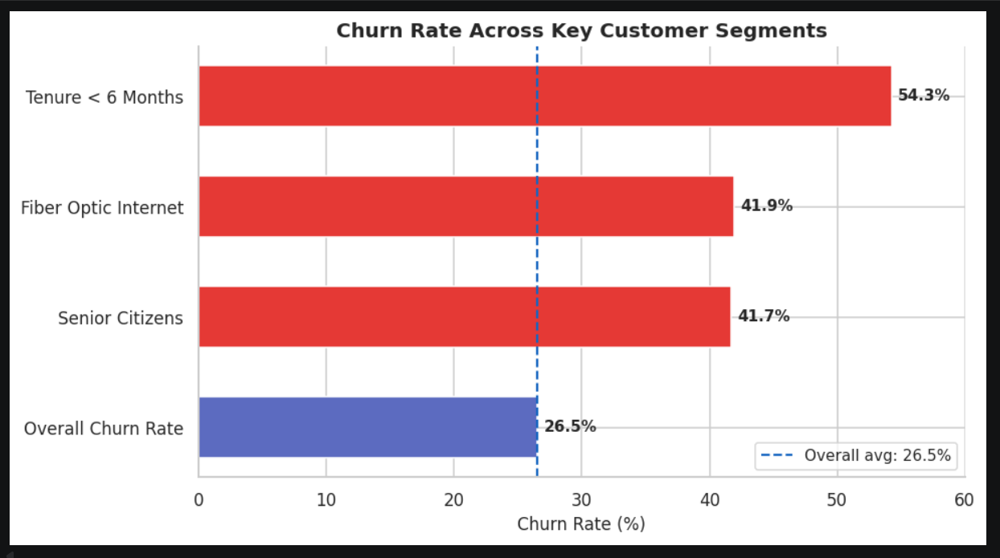

# Customer Churn Analysis (Telco Dataset)

I did this project to understand why customers leave a telecom company and to get some hands on practice with real data. Most tutorials just focus on building models but i wanted to focus more on actually understanding the data and finding patterns that makes sensible business outcomes.

---

## What is this project about

Basically the idea is - A telecom company is losing customers and wants to know why. So i took a real dataset (around 7000 customers) and tried to figure out which type of customers are leaving and what might be causing it.

---

## Dataset

- Telco Customer Churn dataset from Kaggle (IBM sample data)
- 7043 rows, 21 columns
- It has info like how long the customer has been with the company, what plan they are on, monthly charges, whether they use fiber/DSL, and whether they churned or not

---

## Tools used

- Python
- Pandas, NumPy
- Matplotlib, Seaborn
- Jupyter Notebook
- Scikit-learn (for the ml part)

---

## What i did

**Data cleaning**
- TotalCharges column was stored as text for some reason, had to convert it to numeric
- 11 rows had blank values in TotalCharges (turned out these were brand new customers with 0 tenure), filled them with 0
- Converted Churn column from Yes/No to 1/0 so i could do calculations on it

**EDA**
Made charts to answer specific questions like:
- How many customers actually churned? (ans: 26.5%, which is a lot)
- Do new customers leave more? yes, avg tenure of churned customers is 18 months vs 37 months for people who stayed
- Does contract type matter? massively - month to month customers churn at 43%, 2 year contract customers at just 3%
- Do higher charges cause churn? yes, churned customers pay around $74/month vs $61 for retained ones
- Senior citizens churn at almost double the rate of younger customers

One thing that surprised me was fiber optic users had the highest churn (~42%) even though its a better service. Probably because its more expensive and people dont feel it's worth it.

**Machine learning**
Tried 4 models to see if we can predict churn:
- Logistic Regression
- Decision Tree (max_depth=5)
- Random Forest
- KNN (k=5)

Random forest gave the best results. Also the feature importance from RF confirmed what i found in EDA - tenure and monthly charges are the biggest factors.

---
##  Visualizations

### Churn Distribution


### Tenure Analysis


### Contract vs Churn


### Key Segments


## Main findings

- Month to month contract customers = highest churn risk
- Customers in first 6 months = most likely to leave
- Higher monthly charges = more likely to churn
- Senior citizens churn at nearly 2x rate
- Gender has almost no effect on churn

---

## What the company can actually do about it

1. Give discounts to push people from monthly to yearly plans
2. Check in with new customers in the first 3 months before they decide to leave
3. Look into why fiber optic users are unhappy, is it the price or the service quality
4. Create simpler plans for senior citizens

---

## How to run

```
git clone https://github.com/your-username/customer-churn-analysis.git
cd customer-churn-analysis
jupyter notebook
```

then open `customer_churn_analysis.ipynb` and run all cells. make sure the CSV file is in the same folder.

---

## What i learned

- Raw data is always messy, cleaning takes more time than expected
- Accuracy alone is not a good metric when classes are imbalanced, f1 score matters more
- The EDA part is actually more useful than the model sometimes, just looking at the data tells you a lot
- Its important to think about what the numbers mean for the business, not just plot graphs

---

~ by Tanishq Soni


